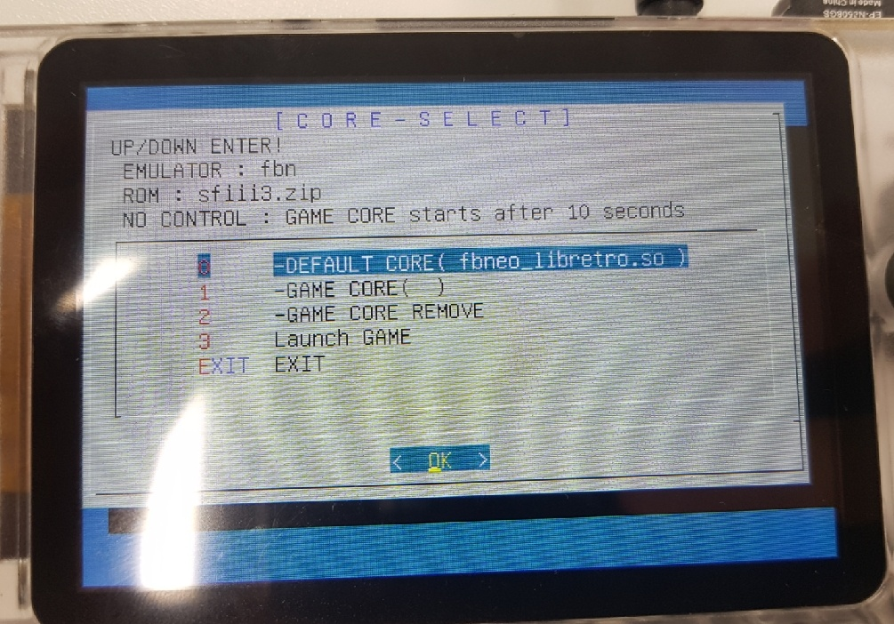
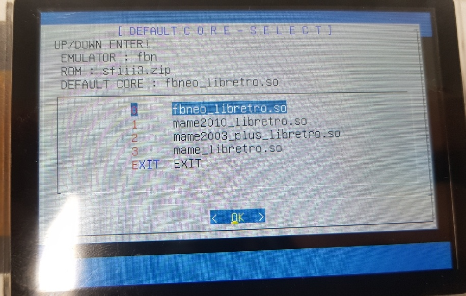
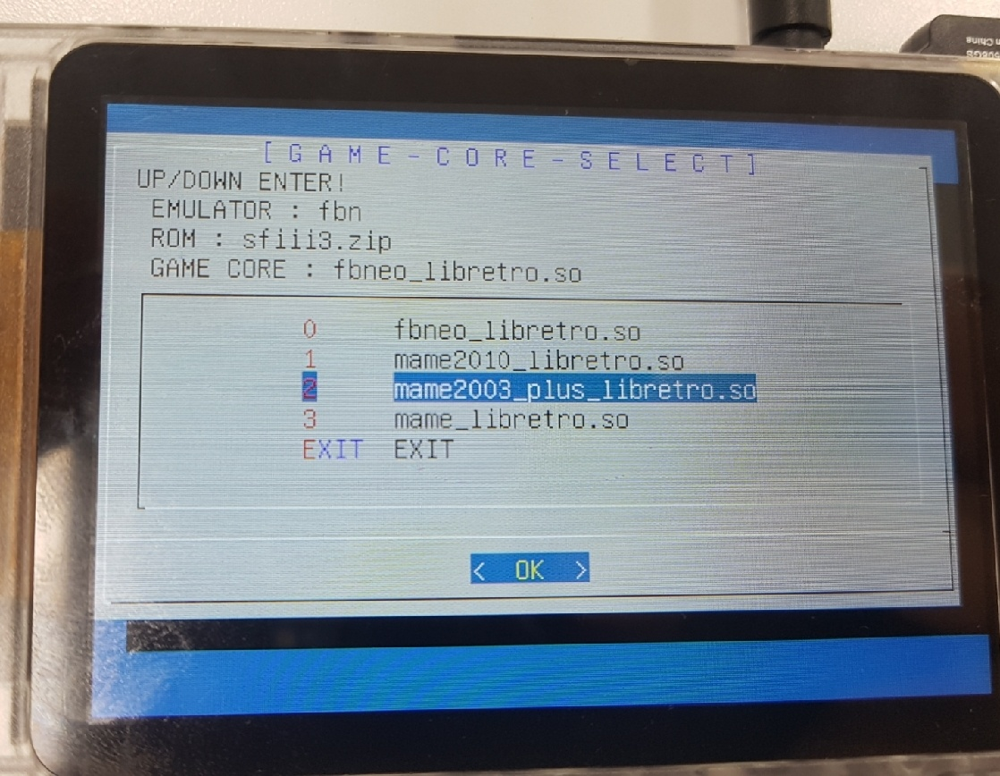
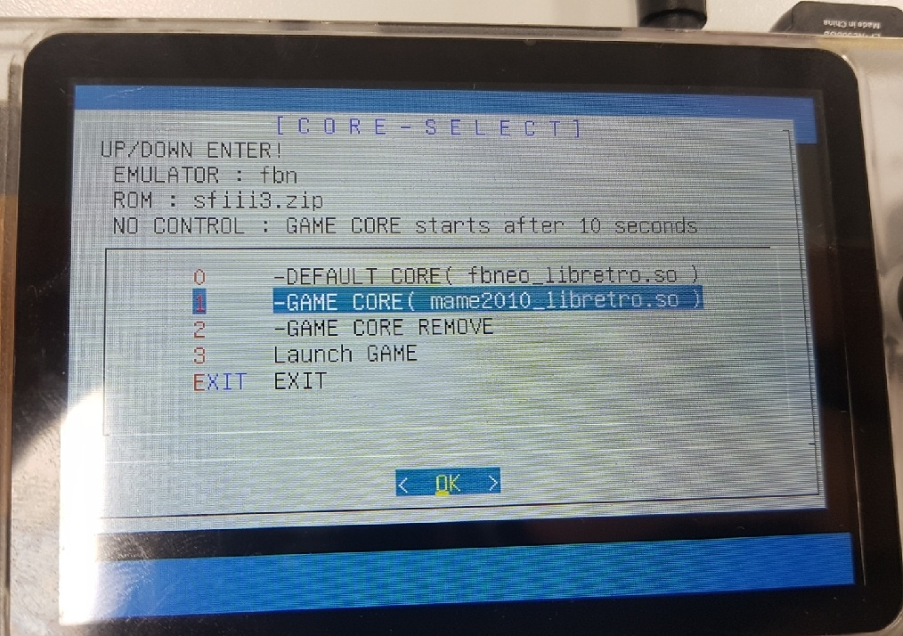

# 리눅스 Dailog - runcommand
##### 라즈베리파이, 오드로이드고 지원( Support Raspberry Pi, Odroid )


### OGA STOCK base image
necessary linux autologin service


## 사전 설치 패키지 (Pre-installation package)

It must be autologin service to work.( linux )

```
sudo apt-get install git
sudo apt-get install dialog
sudo apt-get install psmisc
sudo apt-get install python-pyudev
```

## 설치 방법( How to install )
pi나 odroid 로 로그인하여 진행합니다.( root로 로그인시 ~가 가르키는 경로가 다릅니다. )
( Log in as pi or odroid to proceed. (When logging in as root, the path pointed to by ~ is different.) )
```
git clone https://github.com/sana2dang/linux-runcommand ~/runcommand
cd ~/runcommand
sudo chmod 755 ./runcommand.sh
sudo chmod 755 ./joy2key.py
sudo chmod 755 ./cfg/*
```

## 설정 방법( How to set )
runcommand.cfg 의 내용 수정

```
( 런커맨드 구동 키입력 딜레이 타임 )( runcommand Key Input Delay Time )
TIME=2  

( 런커맨드 Path - 수정 x )( runcommand path - no modify )
RUNCOMMAND_PATH="$SCRIPT_PATH" 

HOME_PATH=`echo ~`

( 레트로아크 64bit Path )( retroarch 64bit path )
RETROARCH_EXEC="/opt/retroarch/bin/retroarch"
CORE_PATH="$HOME_PATH/.config/retroarch/cores"

( 레트로아크 32bit Path )( retroarch 32bit path )
RETROARCH32_EXEC="/opt/retroarch/bin/retroarch32"
CORE32_PATH="$HOME_PATH/.config/retroarch32/cores"

( 로그 파일 )( log file )
LOG_FILE="$RUNCOMMAND_PATH/log.txt"
```

# 에뮬레이터별 코어 설정 방법( cfg/arcade.cfg 예시 )( Core setting method for each emulator )

cfg/ folder save

코어 앞에 "32-"를 붙일 경우 32bit 로 동작합니다.( 실제 코어파일명 변경 x ) (If "32-" is added in front of the core, it operates in retroarch 32 bit.)


arcade.cfg
```
DEFAULT="fbneo_libretro.so"
CORES[0]="fbneo_libretro.so"
CORES[1]="32-mame2003_plus_libretro.so"
CORES[2]="mame2010_libretro.so"
CORES[3]="mame2003_plus_libretro.so"
CORES[4]="mame_libretro.so"
```

스탠드얼론 게임의 경우 명령어를 적어주면 구동됩니다.( .so 파일명이 없는 경우 실행 ) (In the case of standalone games, if you write the command, it will start running. (It runs when there is no ".so" file name) )
(drastic, ppsspp 등 )


psp.cfg
```
DEFAULT="/opt/ppsspp-crashoverride/PPSSPPSDL"
CORES[0]="/opt/ppsspp-crashoverride/PPSSPPSDL"
```

nds.cfg
```
DEFAULT="/home/odroid/drastic/drastic.sh"
CORES[0]="/home/odroid/drastic/drastic.sh"
```


## es_system.cfg 설정 방법( How to set es_system.cfg )
```
<system>
		<name>arcade</name>
		<fullname>Arcade</fullname>
		<path>/roms/arcade</path>
		<extension>.zip .ZIP .7z .7Z</extension>
		<command>~/runcommand/runcommand.sh arcade %ROM%</command>
		<platform>arcade</platform>
		<theme>arcade</theme>
</system>
```

## OGA RetroRoller 용 es_systems.cfg ( es_systems.cfg for OGA RetroRoller )
/etc/emulationstation 에 복사해서 사용합니다.
( Copy to /etc/emulationstation to use. )
```
sudo mv /etc/emulationstation/es_systems.cfg /etc/emulationstation/es_systems.cfg.ori
sudo mv ~/runcommand/es_systems.cfg /etc/emulationstation/es_systems.cfg
```


## 런커맨드 활성화 방법( How to activate runcommand )

게임 시작후 컨트롤러 조작( Controller operation after game start )


</img>
</img>
</img>
</img>


### 참고 링크( Reference link )
https://github.com/RetroPie/RetroPie-Setup/tree/master/scriptmodules/supplementary/runcommand
http://linuxcommand.org/lc3_adv_dialog.php
https://forum.odroid.com/viewtopic.php?f=193&t=38140
